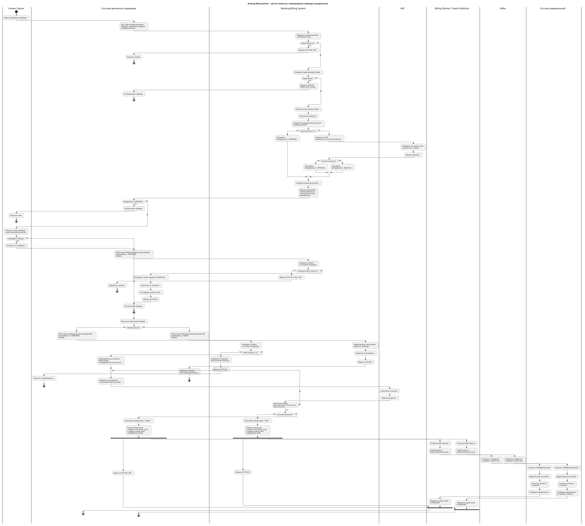

# 1. Назначение

Activity Diagram показывает процесс расчёта комиссии до выполнения денежного перевода, подтверждение операции пользователем, последующее списание комиссии через АБС и асинхронную передачу событий в систему уведомлений.

До выполнения перевода система денежных переводов обращается в Banking Billing System. BBS рассчитывает комиссию и возвращает её сумму вместе с решением о возможности продолжения операции. Система денежных переводов показывает рассчитанную комиссию пользователю. Расчёт комиссии сам по себе не приводит к списанию денежных средств.

Если пользователь отказывается от перевода, система денежных переводов передаёт в BBS статус `CANCELLED`; денежная операция не выполняется и распоряжение на списание комиссии в АБС не формируется. Если пользователь подтверждает перевод, система денежных переводов выполняет его и передаёт итоговый статус в BBS.

После успешного списания комиссии или ошибки списания Banking Billing System регистрирует событие в `outbox_event`. `Billing Worker / Event Publisher` публикует событие в Kafka, после чего его получает внешняя система уведомлений.

# 2. Основные шаги

| № | Шаг | Результат |
|---:|---|---|
| 1 | Пользователь вводит параметры денежного перевода | Сформированы данные операции |
| 2 | Система денежных переводов вызывает `POST /api/v1/billing-operations` | Данные переданы в BBS для расчёта комиссии |
| 3 | BBS проверяет входные данные и `Idempotency-Key` | Исключены некорректные и повторные запросы |
| 4 | BBS определяет тариф и получает необходимые клиентские условия | Получены данные для расчёта |
| 5 | BBS рассчитывает комиссию и сохраняет предварительный результат в `billing_operation` | Расчёт комиссии зафиксирован без создания начисления |
| 6 | Если комиссия больше нуля, BBS обращается в АБС для проверки возможности списания | Получено решение по счёту |
| 7 | BBS возвращает сумму комиссии и `billingDecision` | Система денежных переводов получает предварительный расчёт |
| 8 | При `APPROVED` система денежных переводов показывает пользователю сумму перевода и комиссию | Пользователь принимает решение |
| 9 | Если пользователь отказывается, система денежных переводов вызывает `PATCH /api/v1/billing-operations/{operationId}` с `transferStatus = CANCELLED` | BBS фиксирует отмену операции; перевод не выполняется и комиссия не списывается |
| 10 | Если пользователь подтверждает операцию, выполняется денежный перевод | Получен результат перевода |
| 11 | Система денежных переводов вызывает `PATCH /api/v1/billing-operations/{operationId}` | Итоговый статус перевода передан в BBS |
| 12 | При успешном переводе и ненулевой комиссии BBS формирует `charge` на основании предварительного расчёта и инициирует списание через АБС; при неуспешном переводе начисление не формируется | Биллинговая операция завершается по результату перевода |
| 13 | При успешном списании или технической ошибке BBS в одной транзакции сохраняет итоговый статус и создаёт `outbox_event` | Событие зарегистрировано вместе с бизнес-состоянием |
| 14 | `Billing Worker / Event Publisher` публикует `NEW`-событие в topic `billing.notification-events` | Событие передано в Kafka |
| 15 | Система уведомлений выполняет дедупликацию по `eventId` | Повторная доставка безопасна |
| 16 | Система уведомлений получает контакты по `clientId` и формирует уведомление | Клиент уведомлён |
| 17 | После успешной публикации `outbox_event` переводится в `PUBLISHED` | Зафиксирован факт публикации |

Для операции с нулевой комиссией событие `COMMISSION_PAID` не формируется, так как фактического списания комиссии не происходит.

Событие `COMMISSION_REFUNDED` относится к отдельному сценарию возврата комиссии и в данной Activity Diagram не показывается.

# 3. Асинхронные события

| Событие | Когда формируется | Назначение |
|---|---|---|
| `COMMISSION_PAID` | Комиссия успешно списана | Уведомить клиента об успешном списании |
| `COMMISSION_FAILED` | Списание комиссии завершилось технической ошибкой после предусмотренных попыток | Уведомить о проблеме списания |
| `COMMISSION_REFUNDED` | Комиссия возвращена клиенту | Уведомить о возврате |

Событие содержит `eventId`, `eventType`, `chargeId`, `clientId`, сумму, валюту, `occurredAt` и `correlationId`.

Контактные данные клиента в событие не включаются. Система уведомлений получает их самостоятельно по `clientId`.

# 4. Основные ошибки и альтернативные сценарии

| Ситуация | Результат |
|---|---|
| Некорректные данные | `400 Bad Request` |
| Повторный запрос с другим телом и тем же `Idempotency-Key` | `409 Conflict` |
| Тариф не найден | `422 Unprocessable Content` |
| Недостаточно средств | `billingDecision = REJECTED` |
| Счёт заблокирован или закрыт | `billingDecision = REJECTED` |
| Пользователь отказался от перевода после просмотра комиссии | Система денежных переводов передаёт `transferStatus = CANCELLED`; BBS фиксирует отмену, перевод не выполняется, комиссия не списывается |
| Денежный перевод завершился ошибкой | Комиссия не списывается |
| АБС временно недоступна | Повтор до настроенного лимита попыток, затем техническая ошибка |
| Устаревший `ETag` при PATCH | `412 Precondition Failed` |
| Ресурс уже завершён | `423 Locked` |
| Kafka временно недоступна | Событие остаётся в `outbox_event` и публикуется повторно |
| Система уведомлений недоступна | Биллинговая операция не откатывается; событие остаётся в Kafka до обработки потребителем |

# 5. Описание значимости артефакта

| Раздел | Содержание |
|---|---|
| Процесс и контекст использования | Артефакт используется при проектировании процесса предварительного расчёта комиссии, выполнения денежного перевода, списания комиссии через АБС и асинхронного уведомления клиента. Activity Diagram описывает взаимодействие системы денежных переводов с Banking Billing System, внешними сервисами, АБС, брокером сообщений и системой уведомлений. |
| Цель создания | Зафиксировать последовательность процесса от расчёта и показа комиссии пользователю до завершения биллинговой операции и асинхронной передачи события о результате. Показать основные проверки, альтернативные сценарии и обработку ошибок. |
| Что становится определено | Определяется порядок вызова систем, момент предварительного расчёта комиссии, момент формирования `charge` после успешного перевода, проверка возможности списания, действия при успешном и неуспешном переводе, формирование `outbox_event`, публикация события в Kafka и передача его системе уведомлений. |
| Пользователи артефакта | Системный аналитик использует диаграмму для согласования логики процесса. Разработчики используют её при реализации синхронных и асинхронных взаимодействий. Тестировщики — при подготовке позитивных, негативных и интеграционных сценариев. |
| Использование в дальнейшем | Диаграмма используется как основа для OpenAPI, AsyncAPI, BPMN, Sequence Diagram, тест-кейсов и постановок задач на разработку. |
| Последствия отсутствия | Без артефакта участники команды могут по-разному понимать последовательность действий, момент расчёта и списания комиссии, правила формирования событий и поведение при недоступности брокера или системы уведомлений. |
