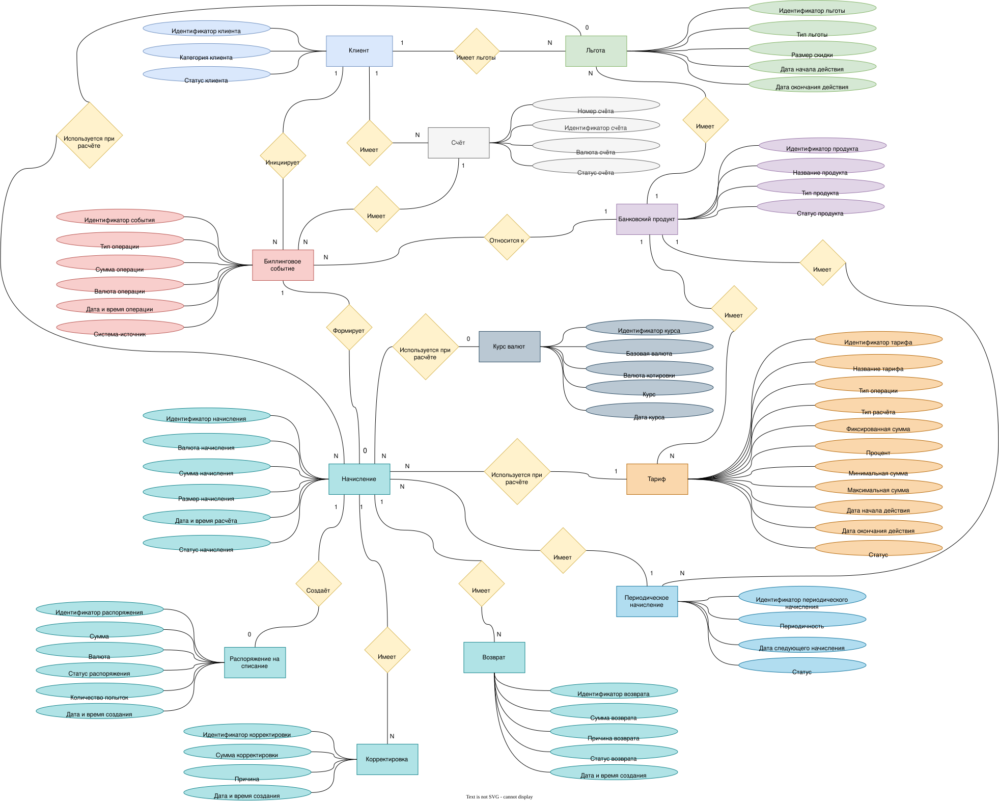
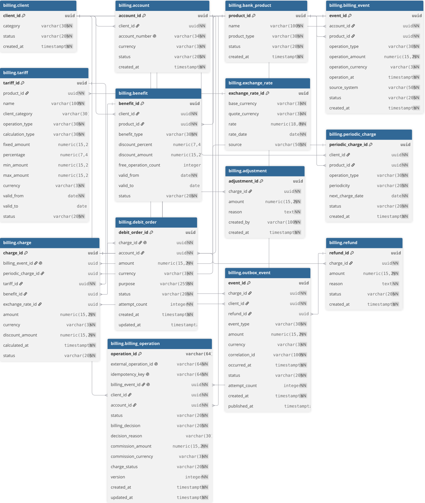
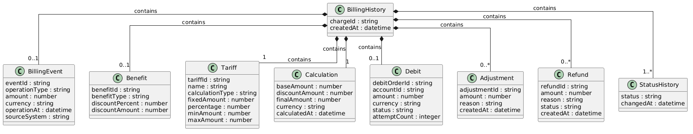

# Модель данных Banking Billing System

## Концептуальная модель данных в нотации Чена

---

## Логическая/физическая модель данных в нотации Мартина

 
### Табличная часть

#### Сущность `client`

| Атрибут | Тип данных | Ограничения | Описание |
|---|---|---|---|
| client_id | UUID | PK | Уникальный идентификатор клиента |
| category | VARCHAR(30) | NOT NULL | Категория клиента |
| status | VARCHAR(20) | NOT NULL, CHECK | Статус клиента |
| created_at | TIMESTAMPTZ | NOT NULL | Дата и время создания записи |

#### Сущность `account`

| Атрибут | Тип данных | Ограничения | Описание |
|---|---|---|---|
| account_id | UUID | PK | Уникальный идентификатор счёта |
| client_id | UUID | FK, NOT NULL | Ссылка на клиента |
| account_number | VARCHAR(34) | NOT NULL, UNIQUE | Номер банковского счёта |
| currency | VARCHAR(3) | NOT NULL | Валюта счёта |
| status | VARCHAR(20) | NOT NULL, CHECK | Статус счёта |
| created_at | TIMESTAMPTZ | NOT NULL | Дата и время создания счёта |

#### Сущность `bank_product`

| Атрибут | Тип данных | Ограничения | Описание |
|---|---|---|---|
| product_id | UUID | PK | Уникальный идентификатор банковского продукта |
| name | VARCHAR(100) | NOT NULL | Наименование продукта |
| product_type | VARCHAR(30) | NOT NULL | Тип банковского продукта |
| status | VARCHAR(20) | NOT NULL, CHECK | Статус продукта |
| created_at | TIMESTAMPTZ | NOT NULL | Дата и время создания записи |

#### Сущность `billing_event`

| Атрибут | Тип данных | Ограничения | Описание |
|---|---|---|---|
| event_id | UUID | PK | Уникальный идентификатор биллингового события |
| account_id | UUID | FK, NOT NULL | Счёт, связанный с операцией |
| product_id | UUID | FK, NOT NULL | Банковский продукт |
| operation_type | VARCHAR(30) | NOT NULL | Тип операции |
| operation_amount | NUMERIC(15,2) | NOT NULL, CHECK > 0 | Сумма операции |
| operation_currency | VARCHAR(3) | NOT NULL | Валюта операции |
| operation_at | TIMESTAMPTZ | NOT NULL | Дата и время операции |
| source_system | VARCHAR(50) | NOT NULL | Система-источник события |
| status | VARCHAR(20) | NOT NULL, CHECK | Статус обработки события |
| created_at | TIMESTAMPTZ | NOT NULL | Дата и время создания записи |

#### Сущность `tariff`

| Атрибут | Тип данных | Ограничения | Описание |
|---|---|---|---|
| tariff_id | UUID | PK | Уникальный идентификатор тарифа |
| product_id | UUID | FK, NOT NULL | Банковский продукт |
| name | VARCHAR(100) | NOT NULL | Название тарифа |
| client_category | VARCHAR(30) | NULL | Категория клиента, для которой действует тариф |
| operation_type | VARCHAR(30) | NOT NULL | Тип тарифицируемой операции |
| calculation_type | VARCHAR(30) | NOT NULL, CHECK | Тип расчёта комиссии |
| fixed_amount | NUMERIC(15,2) | CHECK | Фиксированная часть комиссии |
| percentage | NUMERIC(7,4) | CHECK | Процент комиссии |
| min_amount | NUMERIC(15,2) | CHECK | Минимальная сумма комиссии |
| max_amount | NUMERIC(15,2) | CHECK | Максимальная сумма комиссии |
| currency | VARCHAR(3) | NOT NULL | Валюта тарифа |
| valid_from | DATE | NOT NULL | Дата начала действия тарифа |
| valid_to | DATE | NULL, CHECK | Дата окончания действия тарифа |
| status | VARCHAR(20) | NOT NULL, CHECK | Статус тарифа |

История тарифов хранится отдельными строками. При изменении условий создаётся новая запись с новым периодом действия.

#### Сущность `benefit`

| Атрибут | Тип данных | Ограничения | Описание |
|---|---|---|---|
| benefit_id | UUID | PK | Уникальный идентификатор льготы |
| client_id | UUID | FK, NOT NULL | Клиент |
| product_id | UUID | FK, NOT NULL | Банковский продукт |
| benefit_type | VARCHAR(30) | NOT NULL | Тип льготы |
| discount_percent | NUMERIC(7,4) | CHECK | Процент скидки |
| discount_amount | NUMERIC(15,2) | CHECK | Фиксированная сумма скидки |
| free_operation_count | INTEGER | CHECK | Количество бесплатных операций |
| valid_from | DATE | NOT NULL | Дата начала действия |
| valid_to | DATE | NULL, CHECK | Дата окончания действия |
| status | VARCHAR(20) | NOT NULL, CHECK | Статус льготы |

#### Сущность `exchange_rate`

| Атрибут | Тип данных | Ограничения | Описание |
|---|---|---|---|
| exchange_rate_id | UUID | PK | Уникальный идентификатор курса |
| base_currency | VARCHAR(3) | NOT NULL | Базовая валюта |
| quote_currency | VARCHAR(3) | NOT NULL | Валюта котировки |
| rate | NUMERIC(18,8) | NOT NULL, CHECK > 0 | Курс валют |
| rate_date | DATE | NOT NULL | Дата курса |
| source | VARCHAR(50) | NOT NULL | Источник курса |

#### Сущность `periodic_charge`

| Атрибут | Тип данных | Ограничения | Описание |
|---|---|---|---|
| periodic_charge_id | UUID | PK | Уникальный идентификатор периодического начисления |
| client_id | UUID | FK, NOT NULL | Клиент |
| product_id | UUID | FK, NOT NULL | Банковский продукт |
| operation_type | VARCHAR(30) | NOT NULL | Тип периодической операции |
| periodicity | VARCHAR(20) | NOT NULL, CHECK | Периодичность начисления |
| next_charge_date | DATE | NOT NULL | Дата следующего начисления |
| status | VARCHAR(20) | NOT NULL, CHECK | Статус периодического начисления |
| created_at | TIMESTAMPTZ | NOT NULL | Дата и время создания |

#### Сущность `charge`

| Атрибут | Тип данных | Ограничения | Описание |
|---|---|---|---|
| charge_id | UUID | PK | Уникальный идентификатор начисления |
| billing_event_id | UUID | FK, UNIQUE, NULL | Исходное биллинговое событие |
| periodic_charge_id | UUID | FK, NULL | Периодическое начисление |
| tariff_id | UUID | FK, NOT NULL | Использованный тариф |
| benefit_id | UUID | FK, NULL | Применённая льгота |
| exchange_rate_id | UUID | FK, NULL | Использованный валютный курс |
| amount | NUMERIC(15,2) | NOT NULL, CHECK | Итоговая сумма начисления |
| currency | VARCHAR(3) | NOT NULL | Валюта начисления |
| discount_amount | NUMERIC(15,2) | NOT NULL, DEFAULT 0 | Сумма применённой скидки |
| calculated_at | TIMESTAMPTZ | NOT NULL | Дата и время расчёта |
| status | VARCHAR(20) | NOT NULL, CHECK | Статус начисления |

Источником начисления является либо `billing_event`, либо `periodic_charge`. Одновременное заполнение обоих идентификаторов запрещено ограничением целостности.

#### Сущность `debit_order`

| Атрибут | Тип данных | Ограничения | Описание |
|---|---|---|---|
| debit_order_id | UUID | PK | Уникальный идентификатор распоряжения |
| charge_id | UUID | FK, NOT NULL, UNIQUE | Начисление |
| account_id | UUID | FK, NOT NULL | Счёт списания |
| amount | NUMERIC(15,2) | NOT NULL, CHECK | Сумма списания |
| currency | VARCHAR(3) | NOT NULL | Валюта списания |
| purpose | VARCHAR(255) | NOT NULL | Назначение списания |
| status | VARCHAR(20) | NOT NULL, CHECK | Статус распоряжения |
| attempt_count | INTEGER | NOT NULL, DEFAULT 0 | Количество попыток списания |
| created_at | TIMESTAMPTZ | NOT NULL | Дата и время создания |
| updated_at | TIMESTAMPTZ | NULL, CHECK | Дата и время последнего изменения |

#### Сущность `adjustment`

| Атрибут | Тип данных | Ограничения | Описание |
|---|---|---|---|
| adjustment_id | UUID | PK | Уникальный идентификатор корректировки |
| charge_id | UUID | FK, NOT NULL | Начисление |
| amount | NUMERIC(15,2) | NOT NULL, CHECK <> 0 | Сумма корректировки |
| reason | TEXT | NOT NULL | Причина корректировки |
| created_by | VARCHAR(100) | NOT NULL | Инициатор корректировки |
| created_at | TIMESTAMPTZ | NOT NULL | Дата и время создания |

#### Сущность `refund`

| Атрибут | Тип данных | Ограничения | Описание |
|---|---|---|---|
| refund_id | UUID | PK | Уникальный идентификатор возврата |
| charge_id | UUID | FK, NOT NULL | Начисление |
| amount | NUMERIC(15,2) | NOT NULL, CHECK > 0 | Сумма возврата |
| reason | TEXT | NOT NULL | Причина возврата |
| status | VARCHAR(20) | NOT NULL, CHECK | Статус возврата |
| created_at | TIMESTAMPTZ | NOT NULL | Дата и время создания |

---

## DDL-скрипт PostgreSQL

Скрипт создания схемы, таблиц, ограничений и индексов:

[postgresql_ddl.sql](postgresql_ddl.sql)

## DML-скрипт PostgreSQL

Скрипт наполнения схемы тестовыми данными:

[postgresql_dml.sql](postgresql_dml.sql)

---

# Модель MongoDB

Для хранения агрегированной истории обработки начисления используется коллекция `billing_history`.

Один документ коллекции содержит данные об одном начислении и связанных с ним этапах обработки.

## Class Diagram

Корневой объект `BillingHistory` содержит:

- `BillingEvent` — исходное биллинговое событие;
- `Tariff` — тариф, использованный при расчёте;
- `Benefit` — применённую льготу;
- `Calculation` — результат расчёта;
- `Debit` — результат списания;
- `Adjustment[]` — корректировки;
- `Refund[]` — возвраты;
- `StatusHistory[]` — историю изменения статусов.

## JSON-объект

Пример конечного документа MongoDB:

[JSONobject.json](JSONobject.json)

## JSON Schema

Схема валидации документа по стандарту JSON Schema Draft 7:

[JSONschema.json](JSONschema.json)

## Создание и наполнение MongoDB

Скрипт создания коллекции, настройки валидатора, создания уникального индекса и добавления тестового документа:

[mongodb.js](mongodb.js)

---

# Описание значимости артефакта

| Раздел | Содержание |
|---|---|
| **Процесс и контекст использования** | Артефакт используется на этапе проектирования Banking Billing System при определении структуры хранения и взаимосвязей данных. Концептуальная модель применяется для согласования бизнес-сущностей и связей предметной области, логическая/физическая модель — для проектирования PostgreSQL, а Class Diagram и JSON Schema — для проектирования структуры документов MongoDB. |
| **Цель создания** | Определить и зафиксировать модель данных Banking Billing System, необходимую для хранения клиентов, счетов, банковских продуктов, биллинговых событий, тарифов, льгот, начислений, списаний, корректировок, возвратов и истории обработки начислений. |
| **Что становится определено** | Зафиксированы бизнес-сущности и связи между ними, состав таблиц PostgreSQL, типы данных, первичные и внешние ключи, ограничения целостности, структура MongoDB-документа, правила его валидации, а также скрипты создания и наполнения обеих СУБД. |
| **Пользователи артефакта** | Системный аналитик использует модель для согласования структуры данных и бизнес-логики. Backend-разработчики используют её при реализации слоя хранения и бизнес-операций. DBA использует DDL для создания и сопровождения схемы PostgreSQL. Тестировщики используют модель, ограничения и тестовые данные для подготовки проверок целостности и интеграционных сценариев. |
| **Использование в дальнейшем** | На основании модели могут быть созданы миграции БД, репозитории и DAO, реализованы операции расчёта и списания комиссий, подготовлены API и интеграционные тесты. Модель также используется при анализе изменений требований и расширении Banking Billing System. |
| **Последствия отсутствия** | Без согласованной модели данных возможны неоднозначность хранения бизнес-сущностей, дублирование данных, нарушение ссылочной целостности, ошибки при выборе тарифов и расчёте начислений, а также увеличение времени разработки из-за различного понимания структуры данных участниками команды. |
